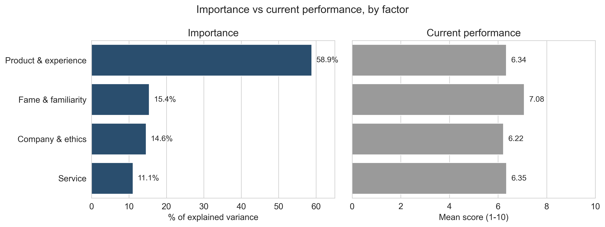
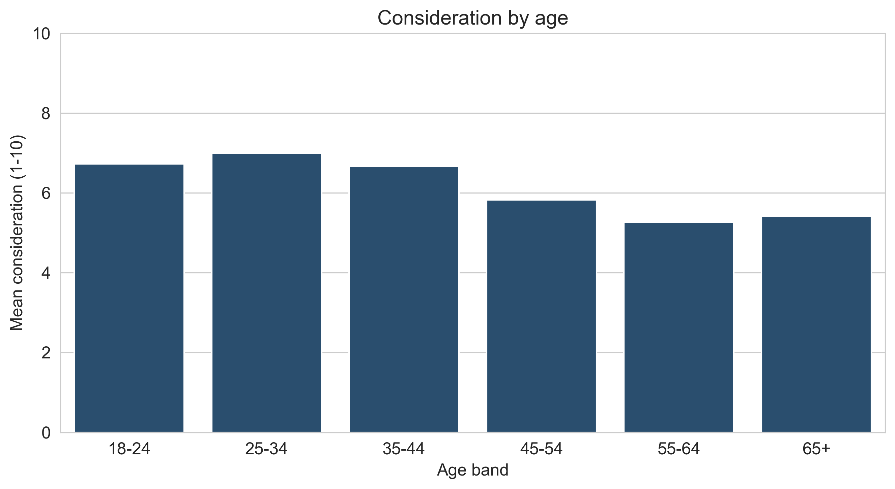
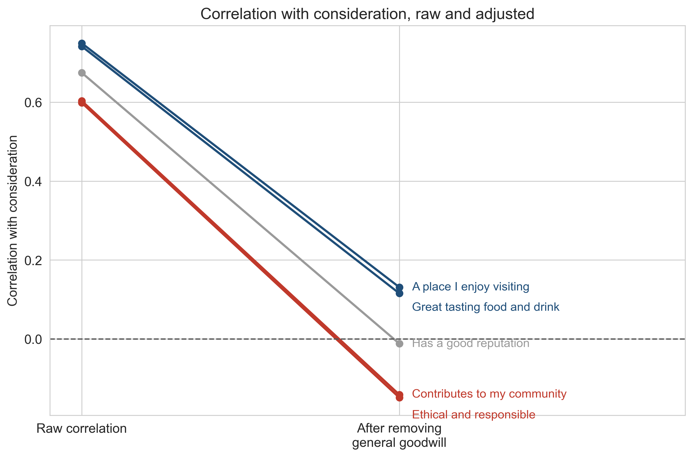
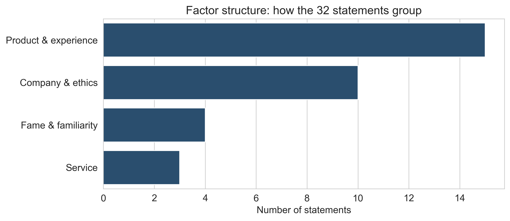
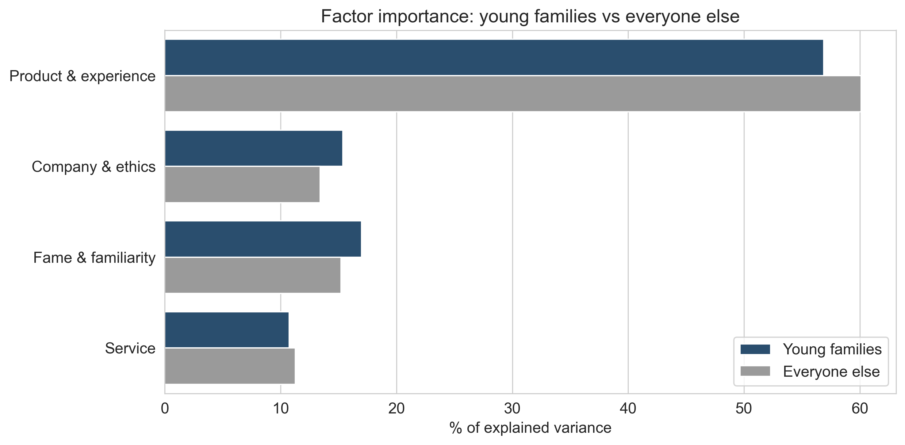
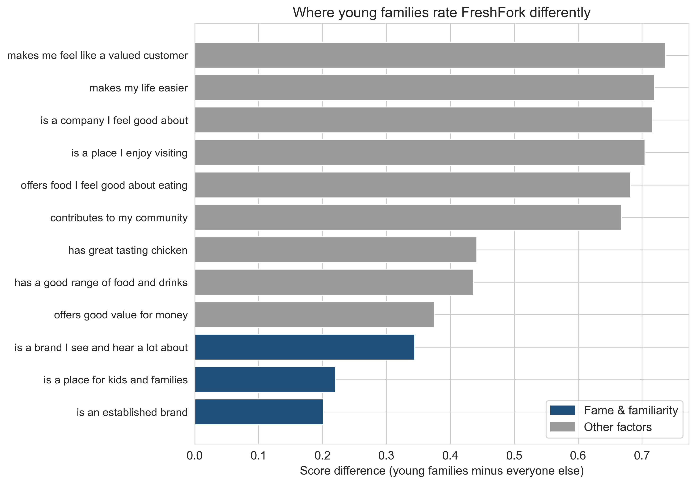

# FreshFork Grill — Brand Consideration & Market Science Case Study

<a href="notes/analysis_notes.md" target="_blank">
  
</a>

## Introduction

This case study analyses **brand consideration** for FreshFork Grill — a fictional
UK quick-service restaurant — using a survey of **2,377 respondents** who each rated
the brand across 34 perception statements and a headline consideration score.

The brief is a familiar one in market science: *what actually drives whether people
would consider FreshFork, and where should the brand invest to grow it?* The
interesting part is that the obvious answer is wrong. FreshFork scores best on the
things that matter least, and the one message a client would instinctively repeat —
"a place for kids and families" — turns out to be settled rather than persuasive.

The project is written as a **reproducible Python pipeline**. A generator builds the
dataset, then seven scripts run in order, each reading a clean dataset written by the
first, so every number in the charts and the write-up can be traced back to code. The
emphasis throughout is on avoiding the standard traps of driver analysis — the **halo
effect**, multicollinearity, and confounded subgroups — rather than reporting the
first regression that runs.

> ### 🧪 A note on the data
> **FreshFork is fictional and the survey is synthetic.** It is generated by
> [`data/generate_survey.py`](data/generate_survey.py), which uses a latent-variable
> model to give the data the structure a real brand tracker has — a dominant "halo",
> a weaker four-factor structure underneath, and a warmer young-families audience —
> plus the messiness a real export carries (text-coded scale points, correlated
> "Don't know" responses, straightliners). **The methods are the point:** the
> analysis is exactly what you would run on real fieldwork, and every figure here is
> produced by the pipeline and reproduces on a rerun. This project began as work on
> a real (confidential) client dataset and was rebuilt on synthetic data so the
> methodology could be shared openly.

### The argument in one paragraph

> FreshFork is strongest exactly where it matters least. Fame and family association
> are its best-scoring perceptions and explain a small share of consideration. Product
> and experience explain the majority of it and sit at 6.34 out of 10. Young families
> are the warmest audience in the sample — they consider FreshFork more even after
> controlling for age, and they weight the four drivers almost identically to everyone
> else. They already know FreshFork is for families. Repeating that message spends
> money confirming something settled. The growth is in giving a warm audience a better
> reason on the food and the experience of the visit.

The full reasoning is in [`notes/analysis_notes.md`](notes/analysis_notes.md); the
data-generation and data-quality decisions are in [`notes/data_notes.md`](notes/data_notes.md).

## Skills Showcased

This project demonstrates an end-to-end survey analytics workflow in Python, from raw
Excel to a defensible business recommendation.

- **🏗️ Data simulation ([`generate_survey.py`](data/generate_survey.py)):** Built a
  latent-variable generator that reproduces a realistic brand-tracker structure — a
  dominant halo dimension, four recoverable factors, an age gradient, and a
  young-families lift — and injected authentic data-quality issues for the pipeline
  to handle.

- **🧹 Data cleaning & recoding ([`01_load_clean.py`](src/01_load_clean.py)):**
  Verified the join between the Demographics and Brand Statements sheets before
  trusting it. Recoded 34 statement columns that store scale endpoints as text
  (`"1 Completely disagree"`) into clean 1–10 numerics, and coded *"Don't know"* as
  **missing** rather than a neutral midpoint — because no opinion is not the same as
  holding one.

- **🔎 Data-quality audit ([`02_audit.py`](src/02_audit.py)):** Investigated
  *"Don't know"* patterns, straightlining, sample composition, and a child-count
  variable cross-checked against six age bands instead of taken on trust.

- **📊 Exploratory analysis ([`03_eda.py`](src/03_eda.py)):** Profiled consideration
  overall and by demographic, and ranked where FreshFork scores strongly (fame,
  family association) versus weakly (personal affinity, ethics).

- **🌗 Halo-effect correction ([`04_halo.py`](src/04_halo.py)):** Showed that ranking
  statements by raw correlation with consideration is misleading. The 32 statements
  correlate at **0.68** on average and a single dimension explains **70%** of their
  variance — respondents largely answer one question 32 times. Used **PCA** to size
  the shared "goodwill" dimension and showed that plain OLS on all 32 statements
  produces sign-flipped coefficients despite passing the usual VIF check.

- **⚖️ Driver analysis via factor reduction ([`05_drivers.py`](src/05_drivers.py)):**
  Reduced the 32 statements to **four near-independent factors** with **Factor
  Analysis**, then regressed consideration on those so the coefficients behave.
  Product & experience explains **59%** of what's explainable; fame, company/ethics
  and service split the rest. Rerun without straightliners as a sensitivity check.

- **🧪 Subgroup testing done properly ([`06_subgroup.py`](src/06_subgroup.py)):**
  Young families look warmer, but parents skew young and consideration falls with age
  — so the effect had to be separated from age. Held age constant within the 35–44
  band and confirmed a significant gap remains (**6.88 vs 6.32, t = 2.97, p = 0.003**).
  Applied a *single* factor structure to both groups so they are measured on the same
  dimensions.

- **📈 Presentation charts ([`07_charts.py`](src/07_charts.py)):** Built six
  publication-ready `matplotlib`/`seaborn` charts that reuse the verified analysis,
  with nothing recalculated — every figure matches what the earlier scripts printed.

---

## Dataset

The analysis reads a single Excel workbook, [`data/raw/freshfork_survey.xlsx`](data/raw)
(written by the generator), containing three sheets:

- **Demographics** — age, gender, children and their age bands, region.
- **Brand Statements** — 34 perception statements rated 1–10, plus the headline
  **consideration** score (`B1c_33`) and an **intent** item (`B1c_34`).
- **Codemap** — variable-to-question lookups.

Key facts about the sample:

- **2,377 respondents**, 63% female / 37% male, mean age ~38, skewing toward younger
  and middle-aged adults (30% are 35–44).
- No population weighting variables, so results describe **this sample**.
- **Young families** (a child under 10) number **936** against **1,441 others**.

The cleaned, analysis-ready dataset is written once to
[`data/clean/responses.parquet`](data/clean) and read by every downstream script.

---

## Analysis Walkthrough

*The pipeline moves from "how considered is FreshFork, and by whom" to "what actually*
*drives that", and finally to "what makes young families different".*

### 1. Consideration today, and how it varies



Mean consideration is **6.45 / 10**. About **36%** score 8–10 and would strongly
consider FreshFork; **13%** score 1–3 and have effectively ruled it out; the middle
half is the winnable group. Consideration **falls with age**, from 7.00 among 25–34s
to around 5.3 among the over-55s, while gender makes little difference. FreshFork
scores highest on *awareness* statements ("an established brand", 7.69) and lowest on
*affinity* ("food I feel good about eating", 5.67): **famous and family-associated,
but not felt to be "for me".**

### 2. The halo problem — why naïve ranking fails



Ranking statements by raw correlation with consideration looks convincing — the top
ten sit between 0.72 and 0.74 — but it's an artefact of shared goodwill. When each
respondent's own average across the 32 statements is subtracted, the picture **flips**:
corporate claims like *ethical & responsible* (+0.60 → **−0.15**) and *contributes to
my community* (+0.60 → **−0.14**) reverse sign, *has a good reputation* collapses from
+0.67 to **−0.01** (a lagging read-out, not a driver), while **product and experience
statements survive** (*enjoy visiting* holds at +0.13, *great tasting food* at +0.12).
Each person's own average predicts consideration at **r = 0.82**, higher than any
single statement — they are largely answering one question 32 times.

### 3. Four drivers, and the mismatch that matters




Factor analysis groups the 32 statements into **four dimensions** — product &
experience (15 statements), company & ethics (10), fame & familiarity (4) and service
(3). Regressing consideration on these four explains **70%** of the variation, and
**product & experience alone takes 59%** of it.

Set that against how FreshFork currently *performs* and the mismatch is the whole
finding: **fame scores highest (7.08) yet is a distant second in importance (15.4%);
product scores 6.34 and explains the most.** The brand's biggest strength is one of
its least important drivers.

### 4. Young families are warmer — and want the same things




Young families consider FreshFork more (6.99 vs 6.09), and a significant gap **survives
an age control** (6.88 vs 6.32 within the 35–44 band). But they don't want *different*
things — their factor weightings are almost identical to everyone else's. What differs
is how warmly they already rate the brand: every factor shows a positive gap. The
largest single-statement gaps are convenience and experience — **"makes my life easier"
(+0.72)**, "a place I enjoy visiting" (+0.70) — while the two *smallest* gaps of all are
**"an established brand" (+0.20)** and **"a place for kids and families" (+0.22)**.
Parents don't believe FreshFork is a family place any *more* than anyone else does.
That message is settled; **convenience and enjoyment are where a warm audience can
still be moved.**

---

## Key Insights

- **High scores ≠ high importance.** FreshFork is strongest on fame and family
  association, drivers that explain far less about consideration than product does.
- **The halo effect hides the truth.** Naïve driver rankings are dominated by general
  goodwill; correcting for it reverses the corporate/ethics claims and leaves product
  and experience as the real levers.
- **Product & experience is the growth engine** — 59% of explained consideration, and
  the dimension FreshFork under-performs on relative to its importance.
- **Young families are the warmest audience**, and it isn't purely an age artefact.
- **They want the same things, just warmer.** The winning message isn't "we're for
  families" (already believed) but **convenience and enjoyment** — "makes my life easier".

## Recommendation

Stop spending to confirm what a warm audience already believes. Redirect investment
from fame/family messaging toward the **product and the experience of the visit** — the
driver that explains most of consideration and where FreshFork has the most room to
improve — with young families as the audience most ready to respond.

---

## How to Reproduce

```bash
pip install -r requirements.txt

python data/generate_survey.py    # writes data/raw/freshfork_survey.xlsx

# run in order — each reads the clean parquet written by the first
python src/01_load_clean.py
python src/02_audit.py
python src/03_eda.py
python src/04_halo.py
python src/05_drivers.py
python src/06_subgroup.py
python src/07_charts.py            # writes charts to output/charts/
```

## Project Structure

```
freshfork-brand-consideration/
├── data/
│   ├── generate_survey.py            # synthetic-survey generator
│   ├── raw/    freshfork_survey.xlsx  # generated source workbook
│   └── clean/  responses.parquet      # cleaned, analysis-ready dataset
├── src/        01–07 *.py             # ordered analysis pipeline
├── notes/      analysis_notes.md, data_notes.md
└── output/
    ├── charts/ 01–06 *.png            # presentation charts
    └── tables/ *.csv                  # factor loadings, means, gaps
```

## Tools Used

`Python` · `pandas` · `NumPy` · `scikit-learn` (PCA, Factor Analysis) · `SciPy` ·
`matplotlib` · `seaborn` · `pyarrow`
